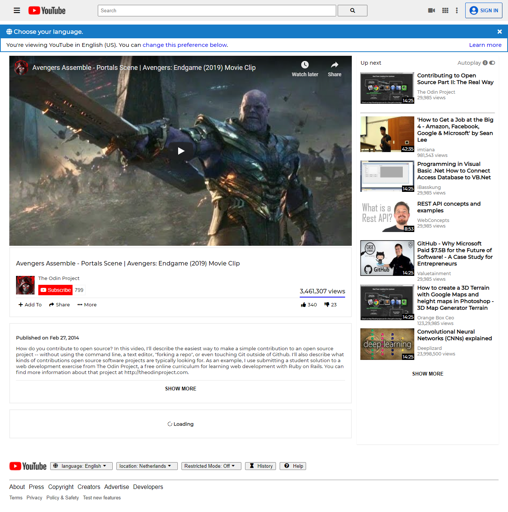

# Embedding-Images-and-Video

This project is the first in the HTML/CSS module at Microverse

## Built With

- HTML
- CSS

## Live demo
[Click here to see the live demo](https://daviidy.github.io/Embedding-Images-and-Video/)

## Authors

👤 **David YAO**
- GitHub: [@daviidy](https://github.com/daviidy)

👤 **CY Kalu**
- GitHub: [@cyonii](https://github.com/cyonii)
- Twitter: [@theOnuoha](https://twitter.com/theOnuoha)

## 🤝 Contributing

Contributions, issues, and feature requests are welcome!

Feel free to check the [issues page](issues/).

## Show your support

Give a ⭐️ if you like this project!
